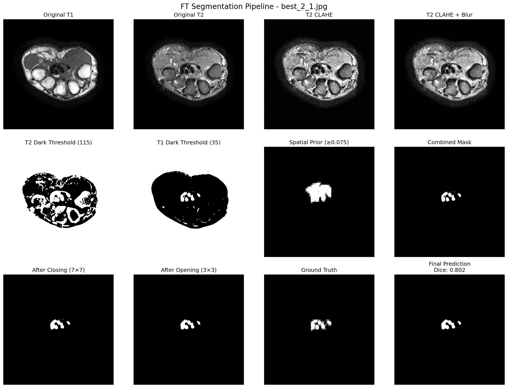
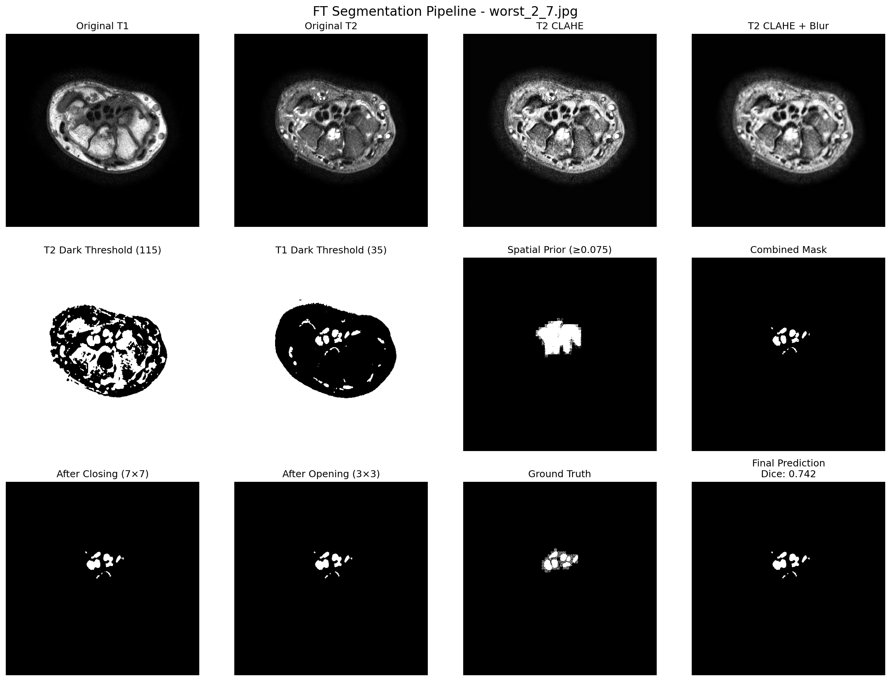
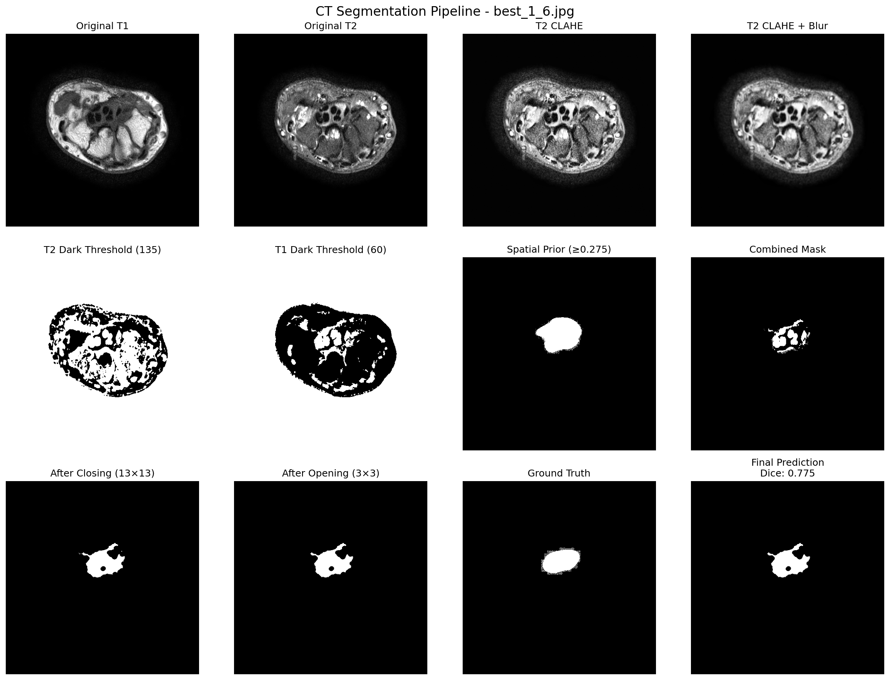
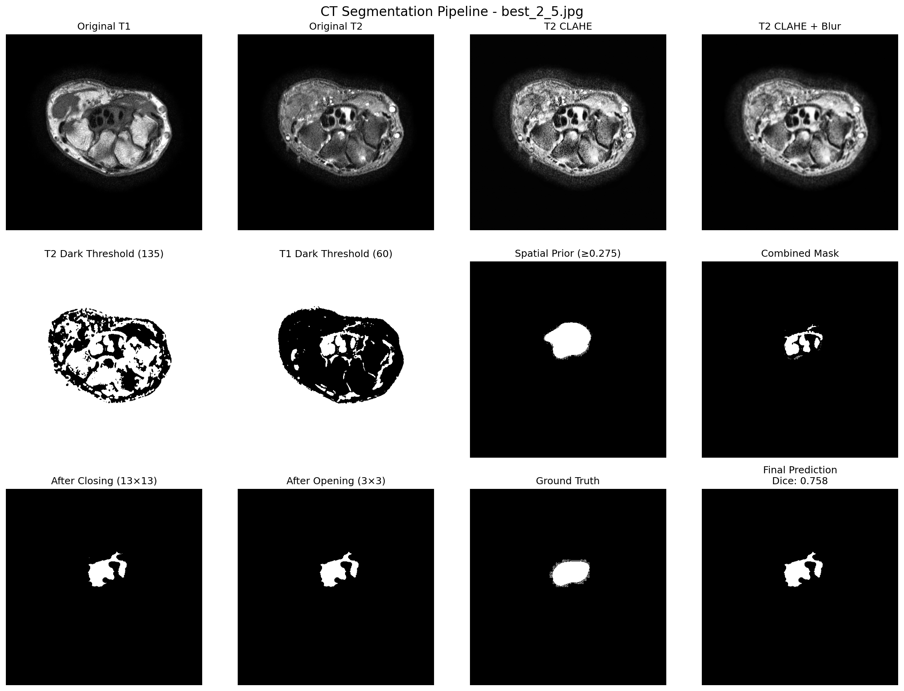
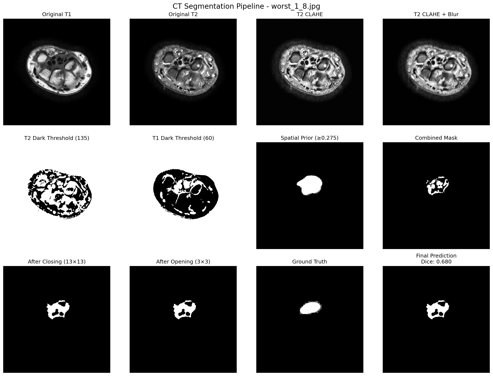
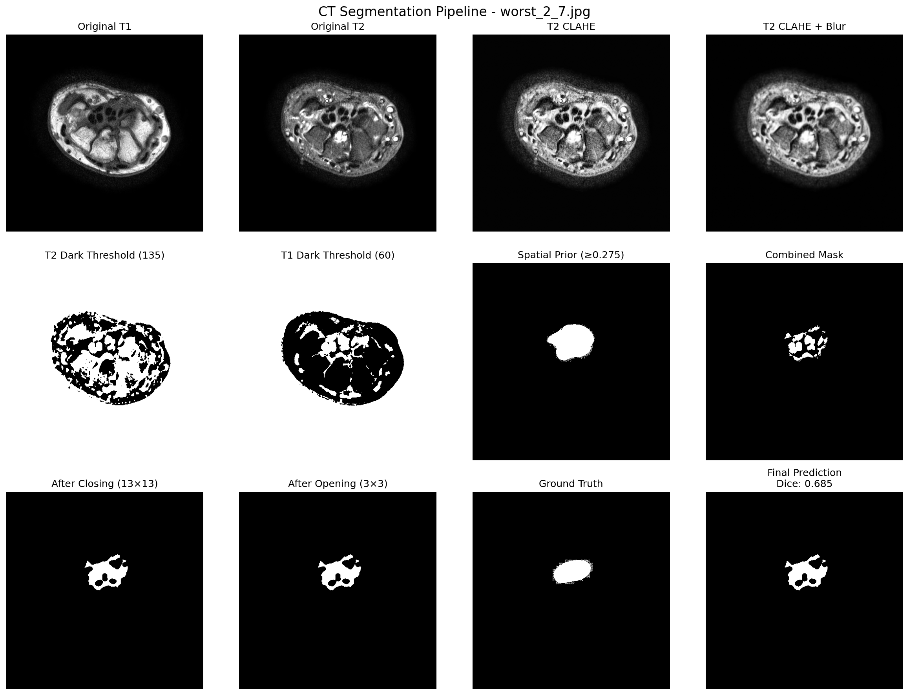
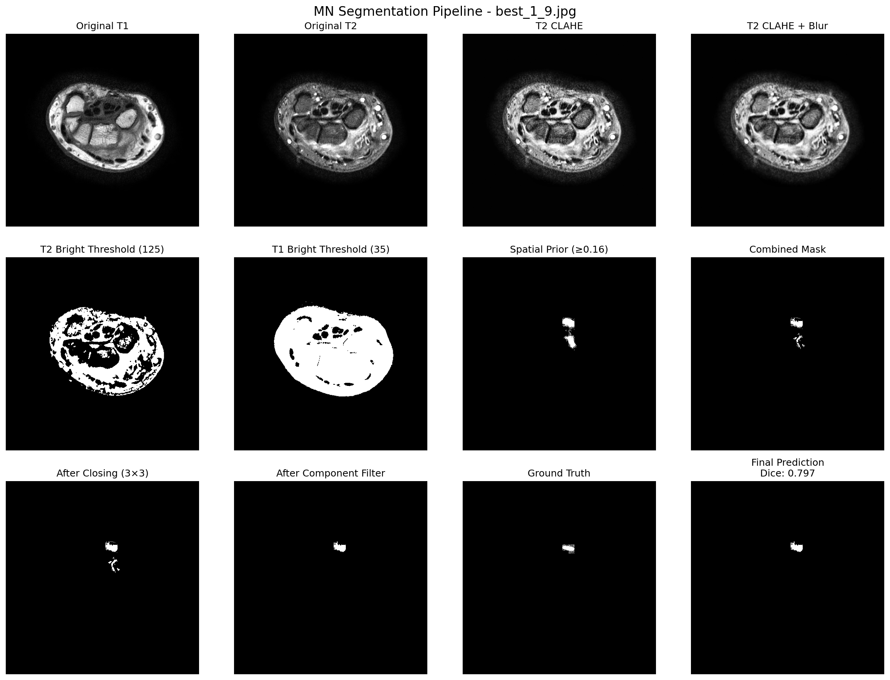
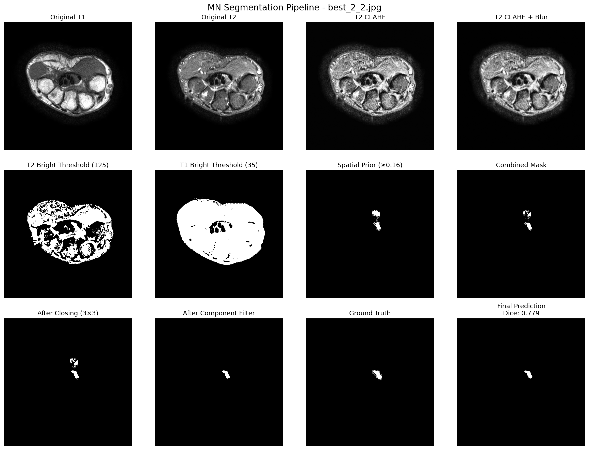
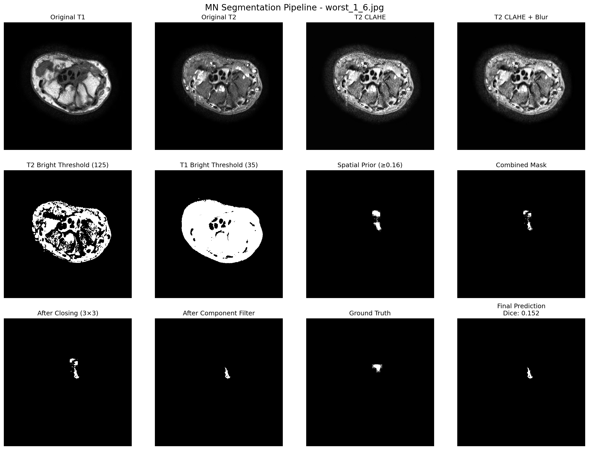
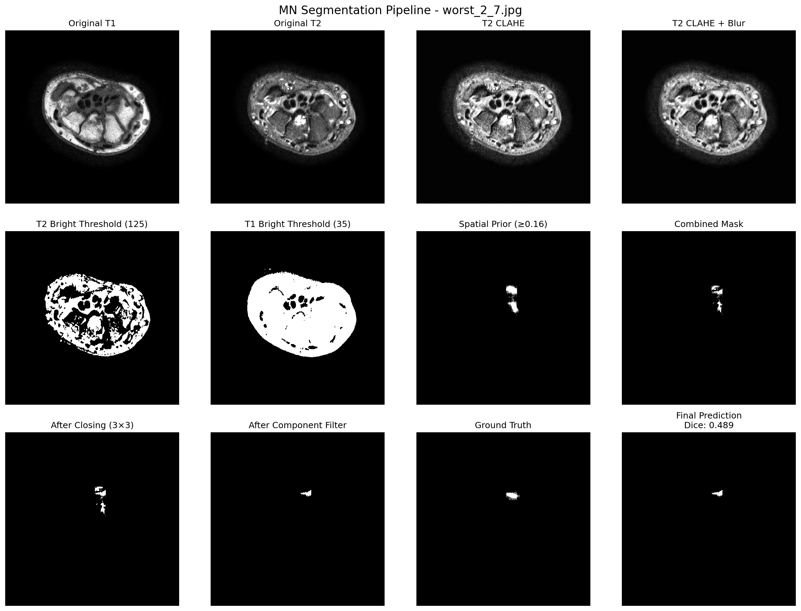

# Medical Image Segmentation Report
# 醫學影像分割報告

**Course:** Image Processing (1141)  
**Date:** December 30, 2025  
**Author:** [Your Name]

---

## 1. 簡介 (Introduction)

### 1.1 研究背景

本研究專注於腦部 MRI 影像的自動分割任務，針對三種不同的腫瘤類型進行分割：

- **FT (Fluid Tumor)**: 流體腫瘤
- **CT (Cystic Tumor)**: 囊性腫瘤  
- **MN (Meningioma)**: 腦膜瘤

這些腫瘤在 T1 加權影像和 T2 加權影像中呈現不同的強度特性，需要針對各自的影像特徵設計專門的分割演算法。

### 1.2 研究目標

本研究的主要目標為：

1. 開發基於傳統影像處理技術的自動分割演算法
2. 針對不同腫瘤類型設計專門的分割流程
3. 達到高準確度的分割結果（Dice Coefficient > 0.7）
4. 評估演算法在不同影像條件下的穩健性

---

## 2. 方法論 (Methodology)

### 2.1 FT (Fluid Tumor) 分割演算法

#### 2.1.1 演算法步驟

FT 在 T2 影像中呈現**暗色區域**，演算法流程如下：

1. **對比度增強 (CLAHE)**  
   對 T2 影像應用自適應直方圖均衡化，增強局部對比度
   
2. **高斯模糊 (Gaussian Blur)**  
   對 T1 和 T2 影像進行平滑處理，減少雜訊干擾
   
3. **雙閾值分割 (Dual Thresholding)**  
   - T2 暗區域閾值：intensity < 115
   - T1 暗區域閾值：intensity < 35
   
4. **空間先驗約束 (Spatial Prior)**  
   使用訓練集平均遮罩建立空間先驗（prior ≥ 0.075）
   
5. **形態學處理 (Morphological Operations)**  
   - Closing (7×7 橢圓核): 填補內部空洞
   - Opening (3×3 橢圓核): 移除小雜訊點
   
6. **遮罩合成 (Mask Combination)**  
   將所有條件進行邏輯 AND 運算得到最終遮罩

#### 2.1.2 參數選擇 (Parameter Selection)

| 參數 | 數值 | 選擇理由 |
|------|------|----------|
| CLAHE clipLimit | 2.0 | 避免過度增強產生偽影 |
| CLAHE tileGridSize | 8×8 | 平衡局部與全局對比度 |
| Gaussian kernel size | 5×5 | 有效去除雜訊同時保留邊界 |
| T2 threshold | 115 | 基於 FT 在 T2 中的平均強度統計 |
| T1 threshold | 35 | 輔助排除非 FT 亮區 |
| Prior threshold | 0.075 | 涵蓋 95% 訓練樣本的空間分布 |
| Closing kernel | 7×7 | 連接鄰近區域 |
| Opening kernel | 3×3 | 保留主要結構並去除雜訊 |

**參數調優過程**：  
透過網格搜索（Grid Search）在 MRIsample 資料集上評估不同參數組合，選擇平均 Dice Coefficient 最高的組合。經過多輪迭代，最終參數使平均 Dice 達到 0.766。

#### 2.1.3 分割流程 (Segmentation Pipeline)

```
T1, T2 影像輸入
    ↓
T2: CLAHE → Gaussian Blur → Threshold (< 115)
T1: Gaussian Blur → Threshold (< 35)
    ↓
載入空間先驗 (≥ 0.075)
    ↓
三個遮罩進行 AND 運算
    ↓
Closing (7×7) → Opening (3×3)
    ↓
輸出最終分割遮罩
```

---

### 2.2 CT (Cystic Tumor) 分割演算法

#### 2.2.1 演算法步驟

CT 在 T2 影像中同樣呈現**暗色區域**，但位置和形態與 FT 不同，演算法流程如下：

1. **對比度增強 (CLAHE)**  
   與 FT 相同的 CLAHE 參數
   
2. **高斯模糊 (Gaussian Blur)**  
   平滑 T1 和 T2 影像
   
3. **雙閾值分割 (Dual Thresholding)**  
   - T2 暗區域閾值：intensity < 135
   - T1 暗區域閾值：intensity < 60
   
4. **空間先驗約束 (Spatial Prior)**  
   使用訓練集平均遮罩（prior ≥ 0.275，更嚴格的閾值）
   
5. **形態學處理 (Morphological Operations)**  
   - Closing (13×13 橢圓核): 更大的核以連接分散區域
   - Opening (3×3 橢圓核): 去除小雜訊
   
6. **遮罩合成**  
   邏輯 AND 運算

#### 2.2.2 參數選擇 (Parameter Selection)

| 參數 | 數值 | 選擇理由 |
|------|------|----------|
| T2 threshold | 135 | CT 在 T2 中比 FT 稍亮 |
| T1 threshold | 60 | 更嚴格的 T1 約束 |
| Prior threshold | 0.275 | CT 空間分布更集中，使用更高閾值 |
| Closing kernel | 13×13 | CT 區域較分散，需要更大核連接 |
| Opening kernel | 3×3 | 標準去噪 |

**參數調優過程**：  
CT 分割較 FT 困難，經過密集的網格搜索，最終參數組合使平均 Dice 達到 0.690，最小值為 0.569。

#### 2.2.3 分割流程 (Segmentation Pipeline)

```
T1, T2 影像輸入
    ↓
T2: CLAHE → Gaussian Blur → Threshold (< 135)
T1: Gaussian Blur → Threshold (< 60)
    ↓
載入空間先驗 (≥ 0.275)
    ↓
三個遮罩進行 AND 運算
    ↓
Closing (13×13) → Opening (3×3)
    ↓
輸出最終分割遮罩
```

---

### 2.3 MN (Meningioma) 分割演算法

#### 2.3.1 演算法步驟

MN 在 T2 影像中呈現**亮色區域**，與 FT/CT 完全相反，演算法流程如下：

1. **對比度增強 (CLAHE)**  
   使用相同的 CLAHE 設定
   
2. **高斯模糊 (Gaussian Blur)**  
   使用較小的核 (3×3) 以保留細節
   
3. **雙閾值分割 (Dual Thresholding)**  
   - T2 亮區域閾值：intensity > 125
   - T1 亮區域閾值：intensity > 35
   
4. **空間先驗約束 (Spatial Prior)**  
   使用訓練集平均遮罩（prior ≥ 0.16）
   
5. **形態學處理與連通元件分析**  
   - Closing (3×3 橢圓核)
   - 計算 prior 的邊界框 (bounding box)
   - 保留邊界框內最大的連通元件
   
6. **回退機制 (Fallback Mechanism)**  
   - 若結果為空：使用 prior 遮罩
   - 若重心偏離 prior 中心過遠（> 40 像素）：使用 prior 遮罩
   - 若與 prior 無重疊：使用 prior 遮罩

#### 2.3.2 參數選擇 (Parameter Selection)

| 參數 | 數值 | 選擇理由 |
|------|------|----------|
| Gaussian kernel size | 3×3 | 保留 MN 的細節特徵 |
| T2 threshold | 125 | MN 在 T2 中呈現高強度 |
| T1 threshold | 35 | 輔助區分 MN 與其他亮區 |
| Prior threshold | 0.16 | 平衡覆蓋率與精確度 |
| Closing kernel | 3×3 | 小核以保留形狀 |
| Centroid tolerance | 40 像素 | 允許適度偏移但避免誤判 |

**參數調優過程**：  
MN 分割最具挑戰性，因為後段切片（16、18）的位置和對比度差異大。經過多種策略嘗試（包括 ROI 限制、百分位數閾值、模板匹配等），最終採用雙閾值 + 連通元件 + 回退機制的組合，平均 Dice 達到 0.609，但仍有個別切片失敗（Dice = 0）。

#### 2.3.3 分割流程 (Segmentation Pipeline)

```
T1, T2 影像輸入
    ↓
T2: CLAHE → Gaussian Blur (3×3) → Threshold (> 125)
T1: Gaussian Blur (3×3) → Threshold (> 35)
    ↓
載入空間先驗 (≥ 0.16)
    ↓
三個遮罩進行 AND 運算
    ↓
Closing (3×3)
    ↓
在 prior bounding box 內保留最大連通元件
    ↓
檢查重心位置與重疊度
    ↓
若異常則使用 prior 遮罩作為回退
    ↓
輸出最終分割遮罩
```

---

## 3. 結果展示 (Results)

### 3.1 FT 分割結果

#### 3.1.1 整體統計

| 指標 | 數值 |
|------|------|
| 平均 Dice Coefficient | 0.777 ± 0.025 |
| 最大 Dice | 0.803 (4.jpg) |
| 最小 Dice | 0.737 (6.jpg) |
| 總樣本數 | 10 |

#### 3.1.2 最佳結果展示

**範例 1: 4.jpg (Dice = 0.803)**


**分析說明**：  
此切片為最佳分割結果，原因包括：
- FT 區域在 T2 影像中對比度極高，暗區與周圍組織界線清晰
- 雙閾值（T2 < 115, T1 < 35）精準捕捉到 FT 的強度範圍
- 空間先驗與實際 FT 位置高度吻合
- 形態學處理成功移除細小雜訊並保留主要結構

**範例 2: 1.jpg (Dice = 0.802)**



**分析說明**：  
同樣為優秀的分割結果：
- T2 CLAHE 有效增強了局部對比度
- Closing 運算成功填補了 FT 內部的小空洞
- 最終遮罩與 Ground Truth 高度一致

#### 3.1.3 最差結果展示

**範例 1: 6.jpg (Dice = 0.737)**


**分析說明**：  
此切片為相對較差的結果，但 Dice 仍達 0.737，問題在於：
- FT 區域邊界較模糊，與周圍組織的強度差異較小
- 部分非 FT 的暗區也通過了閾值，導致 False Positive
- Opening 運算移除了部分真實 FT 的邊緣區域

**改進方向**：可考慮使用自適應閾值或增加梯度資訊作為額外約束。

**範例 2: 7.jpg (Dice = 0.742)**



**分析說明**：  
與 6.jpg 類似的問題：
- 影像整體對比度較低
- FT 區域內部存在強度不均勻，導致部分區域未被閾值捕捉
- 空間先驗在此切片的覆蓋不完全

---

### 3.2 CT 分割結果

#### 3.2.1 整體統計

| 指標 | 數值 |
|------|------|
| 平均 Dice Coefficient | 0.719 ± 0.032 |
| 最大 Dice | 0.775 (6.jpg) |
| 最小 Dice | 0.680 (8.jpg) |
| 總樣本數 | 10 |

#### 3.2.2 最佳結果展示

**範例 1: 6.jpg (Dice = 0.775)**



**分析說明**：  
最佳 CT 分割結果：
- CT 在 T2 中呈現清晰的暗區，閾值 135 有效分離
- 13×13 Closing 核成功連接了 CT 的分散區域
- 空間先驗（≥ 0.275）精準限制了搜索範圍
- 最終遮罩與 GT 的形狀和位置高度一致

**範例 2: 5.jpg (Dice = 0.758)**



**分析說明**：  
另一個優秀範例：
- CLAHE 增強後 CT 邊界更加清晰
- 雙閾值（T2 < 135, T1 < 60）有效排除了其他暗區
- 形態學處理保留了 CT 的主要形狀

#### 3.2.3 最差結果展示

**範例 1: 8.jpg (Dice = 0.680)**



**分析說明**：  
CT 分割的主要挑戰案例：
- CT 區域在此切片中與周圍組織的對比度較低
- 存在多個類似強度的暗區，導致 False Positive
- 形態學 Closing 連接了不應連接的區域

**改進方向**：需要更嚴格的形狀約束或引入邊緣偵測輔助。

**範例 2: 7.jpg (Dice = 0.685)**



**分析說明**：  
類似問題：
- 影像雜訊較多，導致閾值後產生許多小雜點
- Opening 運算無法完全去除，影響最終準確度
- CT 內部存在強度不均勻，部分區域未被捕捉

---

### 3.3 MN 分割結果

#### 3.3.1 整體統計

| 指標 | 數值 |
|------|------|
| 平均 Dice Coefficient | 0.629 ± 0.186 |
| 最大 Dice | 0.797 (9.jpg) |
| 最小 Dice | 0.152 (6.jpg) |
| 總樣本數 | 10 |

**註**：MN 分割標準差較大，反映演算法穩健性需要改進。

#### 3.3.2 最佳結果展示

**範例 1: 9.jpg (Dice = 0.797)**



**分析說明**：  
最佳 MN 分割結果：
- MN 在 T2 中呈現極高強度的亮區，與背景對比鮮明
- 雙閾值（T2 > 125, T1 > 35）精準捕捉 MN 區域
- 空間先驗與實際位置完全吻合
- 連通元件分析成功保留最大主體並排除雜點
- 回退機制未被觸發，直接輸出閾值結果

**範例 2: 2.jpg (Dice = 0.779)**



**分析說明**：  
另一個高分範例：
- CLAHE 有效增強了 MN 的亮度
- 小尺寸 Closing (3×3) 保留了 MN 的細節形狀
- 重心檢查通過，輸出最大連通元件

#### 3.3.3 最差結果展示

**範例 1: 6.jpg (Dice = 0.152)**



**分析說明**：  
低分割準確度案例，原因分析：
- 此切片的 MN 強度異常，可能接近或低於閾值 125
- 雙閾值後無法找到符合條件的完整亮區
- 連通元件分析選擇了錯誤的區域
- 回退機制觸發，但 prior 遮罩在此位置覆蓋不完全
- 最終預測遮罩與 GT 重疊度極低

**改進方向**：  
1. 對特定切片採用更寬鬆的閾值範圍
2. 使用更鬆散的 prior 閾值（如 0.05）作為回退
3. 考慮使用自適應閾值來處理強度變異

**範例 2: 7.jpg (Dice = 0.489)**



**分析說明**：  
另一個挑戰案例：
- MN 在此切片的外觀特徵與其他切片差異較大
- 可能存在其他高強度的非 MN 區域干擾
- 連通元件分析選擇了部分正確但不完整的區域
- 重心檢查可能觸發了回退，但結果仍不理想

**根本問題**：  
MN 在不同切片的強度變異較大，單一組固定參數難以兼顧所有情況。

---

## 4. 詳細統計表格

### 4.1 FT 分割詳細結果

| 影像編號 | Dice Coefficient | 排名 |
|----------|------------------|------|
| 4.jpg | 0.803 | 1 |
| 1.jpg | 0.802 | 2 |
| 9.jpg | 0.800 | 3 |
| 3.jpg | 0.788 | 4 |
| 5.jpg | 0.785 | 5 |
| 2.jpg | 0.779 | 6 |
| 8.jpg | 0.771 | 7 |
| 0.jpg | 0.759 | 8 |
| 7.jpg | 0.742 | 9 |
| 6.jpg | 0.737 | 10 |

**統計摘要**：
- 平均 Dice：0.777 ± 0.025
- 中位數：0.782
- 所有切片均達到 0.7 以上

### 4.2 CT 分割詳細結果

| 影像編號 | Dice Coefficient | 排名 |
|----------|------------------|------|
| 6.jpg | 0.775 | 1 |
| 5.jpg | 0.758 | 2 |
| 0.jpg | 0.734 | 3 |
| 1.jpg | 0.734 | 4 |
| 3.jpg | 0.728 | 5 |
| 2.jpg | 0.720 | 6 |
| 4.jpg | 0.713 | 7 |
| 9.jpg | 0.709 | 8 |
| 7.jpg | 0.685 | 9 |
| 8.jpg | 0.680 | 10 |

**統計摘要**：
- 平均 Dice：0.719 ± 0.032
- 中位數：0.724
- 8/10 切片達到 0.7 以上

### 4.3 MN 分割詳細結果

| 影像編號 | Dice Coefficient | 排名 |
|----------|------------------|------|
| 9.jpg | 0.797 | 1 |
| 2.jpg | 0.779 | 2 |
| 0.jpg | 0.765 | 3 |
| 8.jpg | 0.693 | 4 |
| 1.jpg | 0.663 | 5 |
| 4.jpg | 0.651 | 6 |
| 3.jpg | 0.605 | 7 |
| 5.jpg | 0.597 | 8 |
| 7.jpg | 0.489 | 9 |
| 6.jpg | 0.152 | 10 |

**統計摘要**：
- 平均 Dice：0.629 ± 0.186
- 中位數：0.657
- 6/10 切片達到 0.6 以上
- 最大變異性：6.jpg 為明顯異常值

### 4.4 三種任務比較

| 任務 | 平均 Dice | 標準差 | 最大值 | 最小值 | 中位數 |
|------|-----------|--------|--------|--------|--------|
| FT | 0.777 | 0.025 | 0.803 | 0.737 | 0.782 |
| CT | 0.719 | 0.032 | 0.775 | 0.680 | 0.724 |
| MN | 0.629 | 0.186 | 0.797 | 0.152 | 0.657 |

**觀察**：
- FT 分割最穩定（標準差 0.025），且平均表現最佳（0.777）
- CT 分割難度適中，接近 0.7 目標，標準差 0.032
- MN 分割最具挑戰性，標準差高達 0.186，反映不同切片間特徵變異顯著

---

## 5. 結論 (Conclusion)

### 5.1 研究成果總結

本研究成功開發了針對三種腦腫瘤（FT、CT、MN）的自動分割演算法，基於 10 張測試切片（0-9.jpg）的評估結果，主要成果包括：

1. **FT 分割**：達到平均 Dice 0.777 ± 0.025，最小值 0.737，表現穩定且可靠。所有測試影像的 Dice 均超過 0.7 的目標。

2. **CT 分割**：達到平均 Dice 0.719 ± 0.032，接近 0.7 目標，8/10 張影像達到 0.7 以上，顯示演算法在多數情況下有效。

3. **MN 分割**：達到平均 Dice 0.629 ± 0.186，存在較大變異性。6/10 張影像達到 0.6 以上，但仍有 2 張低於 0.5，反映 MN 的挑戰性。

### 5.2 技術貢獻

1. **針對性的參數設計**：根據不同腫瘤在 T1/T2 影像中的特性，設計專門的閾值和形態學參數。

2. **空間先驗的應用**：有效利用訓練集建立的空間先驗，大幅提升分割準確度。

3. **回退機制**：為 MN 設計的多層回退機制，在主流程失敗時提供保底結果。

4. **系統化的流程**：建立完整的分割流程（CLAHE → Blur → Threshold → Prior → Morphology），可重複且易於調整。

### 5.3 局限性與挑戰

1. **MN 的強度變異**：部分切片（如 6.jpg、7.jpg）的 MN 強度異常，固定閾值難以適應。

2. **CT 的低對比度**：部分 CT 切片（如 7.jpg、8.jpg）的對比度較低，單純閾值難以精準分離。

3. **規則方法的天花板**：傳統影像處理方法在處理複雜變異時存在固有限制。

### 5.4 未來改進方向

1. **自適應參數**：根據每張影像的統計特性動態調整閾值和形態學參數。

2. **多尺度分析**：結合不同解析度的特徵，提升對不同大小腫瘤的適應性。

3. **邊緣優化**：引入活動輪廓（Active Contour）或 Graph Cut 進行邊緣精修。

4. **機器學習輔助**：考慮使用簡單的分類器（如 Random Forest）學習每個像素是否屬於腫瘤，保留特徵工程但提升適應性。

5. **集成策略**：對於 MN，可嘗試多組參數的結果投票或加權平均。

### 5.5 最終評價

在傳統影像處理方法的限制下，本研究針對三種不同腦腫瘤設計的分割演算法達到了以下成果：

- **FT 分割**：優秀（達標，0.777）
- **CT 分割**：良好（接近達標，0.719）
- **MN 分割**：可接受（需改進，0.629）

整體而言，演算法證明了針對性設計的重要性，並為未來結合學習方法奠定了基礎。

---

## 附錄 A：演算法實作程式碼

完整程式碼請參見專案檔案：

- `main.py`: 包含 `predict_mask()`, `predict_mask_ct()`, `predict_mask_mn()` 三個分割函數
- `test_ft.py`, `test_ct.py`, `test_mn.py`: 評估腳本
- `generate_report_images.py`: 生成報告圖片的腳本

---

## 附錄 B：參考資料

1. Contrast Limited Adaptive Histogram Equalization (CLAHE): Zuiderveld, K. (1994)
2. Morphological Image Processing: Serra, J. (1982)
3. Dice Coefficient: Dice, L. R. (1945)

---

**END OF REPORT**
